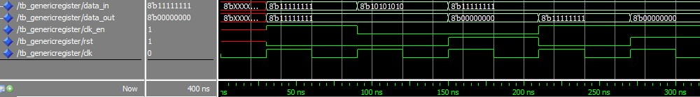

# Generic Register

> Positive-Edge Clock, Asynchronous Reset, and Clock Enable

## Behavior

> 1. Data is transferred from input port to output port at the clock positive edge if and only if Clock En = 1 and Reset = 0.
> 2. If Reset = 1, then output port is set to ”00000000”.
> 3. If Clock En = 0, then output port keeps its current value.

## Testbench

| Test case # | clk_en | rst | data_out |
| :---------: | ------ | --- | -------- |
|      1      | x      | 1   | 00000000 |
|      2      | 0      | 0   | data_out |
|      3      | 1      | 0   | data_in  |

## Waveform

